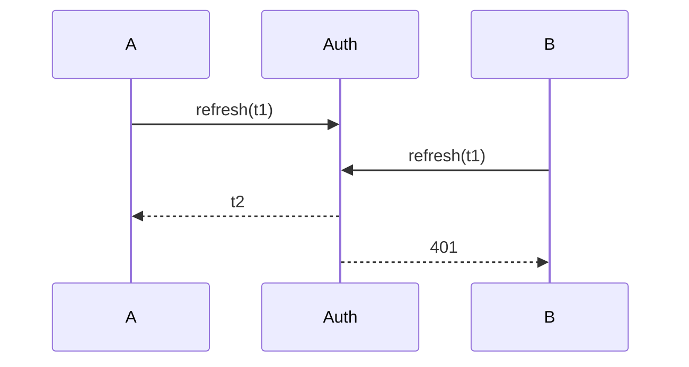

# 원인

두 요청이 같은 refresh 토큰으로 **동시에** 갱신하면 먼저 끝난 쪽이 토큰을 회전시키고, 늦은 쪽은 무효 토큰을 받는다.

```mermaid
sequenceDiagram
  A->>Auth: refresh(t1)
  B->>Auth: refresh(t1)
  Auth-->>A: t2
  Auth-->>B: 401
```

## 해결 후보

1. 갱신 구간에 분산 락
2. 이전 토큰 유예 5초
